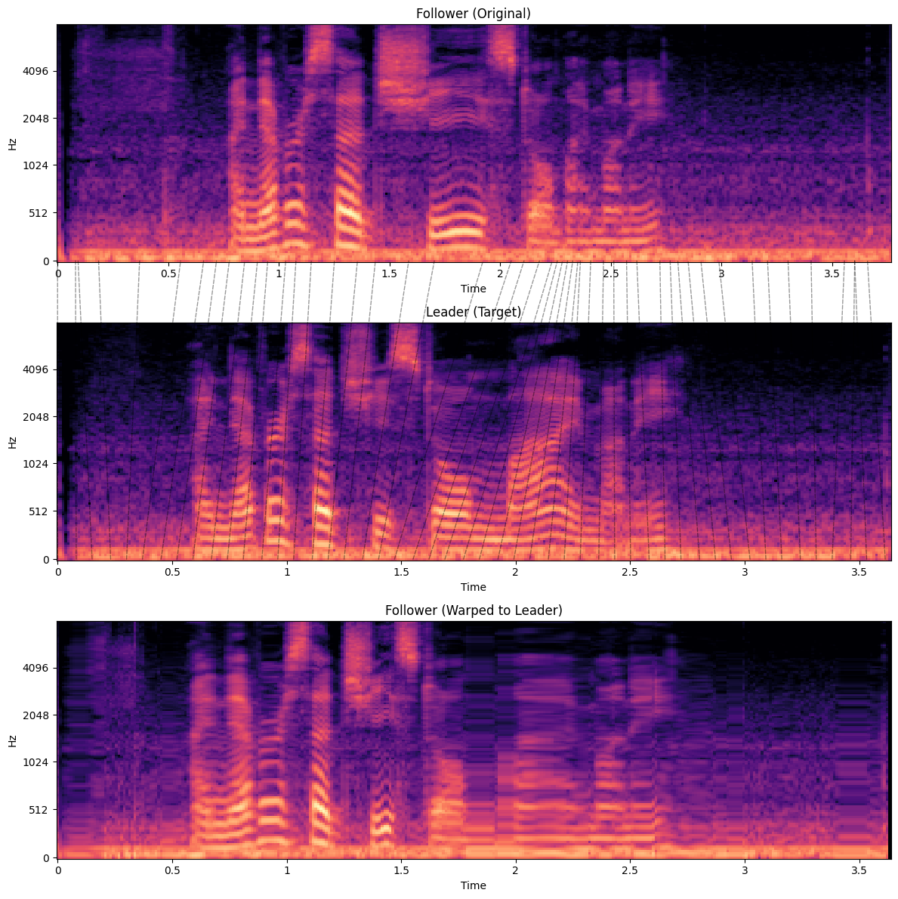

# Multidimensional Dynamic Time Warping (GDTW) for Speech and High-Dimensional Signals

This repository extends the original [GDTW library](https://dderiso.github.io/gdtw/) to support **multidimensional signal alignment**, with a focus on applications in speech processing.

Key updates in this [`multidim`](https://github.com/prlabu/gdtw/tree/multidim) branch:

- Supports signals of shape `(n_time, n_dims)`, enabling use with multichannel or feature-rich time series like MFCCs or sensor arrays.
- Updated loss function signature: `loss(x, y)` instead of `loss(x - y)` for more flexibility.
- Built-in support for **cosine distance**, alongside L1 and L2 loss functions.
- Speech demo using **MFCC deltas** to align utterances with varying prosody:
  [Try it in Google Colab ▶️](https://colab.research.google.com/drive/1l1OIBvLdHCTEC9_kpZtgZt8vDPbkDNyp#scrollTo=4iohomMdv9b_)

## 🔍 Use Cases
- Speech signal alignment
- Multisensor trajectory analysis
- MFCC/embedding warping for prosody manipulation
- Motion capture 
- Any high-dimensional dynamic time warping

## 🔗 Related Work
[DTWSpeech](https://github.com/aishoot/DTWSpeech)

[speech_dtw (Kamper et al.)](https://github.com/kamperh/speech_dtw)

The original GDTW paper notes that these approaches often require additional pre- and post-processing to avoid singularities. Our implementation builds directly on GDTW's stability and extends it to richer input modalities.